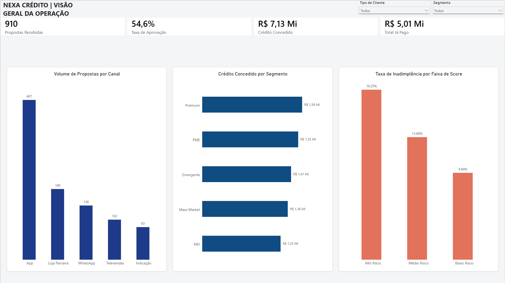

# Nexa Crédito | Pipeline Analítico & Dashboard Executivo

Este repositório apresenta a consolidação e engenharia de dados da operação de crédito da fintech **Nexa Crédito**, integrando fluxos de propostas, concessão de contratos, cobrança e pagamentos em uma camada analítica centralizada, consistente e auditável.

---

## 📊 Dashboard Executivo (Power BI)

A interface foi projetada em página única com resolução Full HD (1920x1080), priorizando leitura executiva imediata, alto data-ink ratio e navegação por filtros dimensionais cruzados.



* 📄 **Visualização Imediata em PDF:** [`power_bi/Nexa_Dash.pdf`](power_bi/Nexa_Dash.pdf)
* 📊 **Arquivo Power BI:** [`power_bi/Nexa_Dash.pbix`](power_bi/Nexa_Dash.pbix)
* 📓 **Notebook com Pipeline PySpark/SQL:** [`notebooks/case_nexa_credito_jhonatan.ipynb`](notebooks/Case_Nexa_Cr%C3%A9dito_Jhonatan.ipynb)

---

## 🏗️ Modelagem e Arquitetura de Dados

Para resolver divergências métricas entre áreas operacionais e contábeis sem incorrer em armadilhas de produto cartesiano (*fan-out trap*), o pipeline foi dividido em duas camadas de modelagem:

```
                  [ Fontes Operacionais Brutas (CSVs) ]
                                    │
                                    ▼
       [ Camada Dimensional Star Schema (Views Temporárias PySpark) ]
       ├── dim_cliente
       ├── dim_calendario
       ├── fato_propostas
       ├── fato_contratos
       ├── fato_parcelas
       └── fato_pagamentos
                                    │
                                    ▼
                 [ Camada Analítica Especializada (OBTs) ]
        ┌───────────────────────────┴───────────────────────────┐
        ▼                                                       ▼
obt_funil_originacao                                  obt_carteira_cobranca
(Grão: 1 linha por Proposta/Contrato)                 (Grão: 1 linha por Parcela/Pagamentos)
```

### Detalhamento das Tabelas Consolidadas (OBTs):

1. **`obt_funil_originacao` (Grão: Proposta):**
   * Consolida atributos do cliente, solicitação da proposta e status de efetivação do contrato via `LEFT JOIN`.
   * **Finalidade:** Responder com integridade volumetrias de entrada, taxas de conversão, dispersão entre valor solicitado e concedido, motivos de recusa e funil por canal de aquisição.

2. **`obt_carteira_cobranca` (Grão: Parcela):**
   * Agrupa previamente os pagamentos por parcela via CTE (`GROUP BY id_parcela`) antes de enriquecer com dados de contrato e cliente.
   * **Finalidade:** Monitorar o cronograma de liquidação financeira, amortização de principal vs. juros, impacto de multas/descontos e cálculo exato da taxa de inadimplência sem duplicação de saldo.

---

## 🛠️ Tratamento de Inconsistências e Regras de Negócio

Conforme orientado no desafio técnico, foram identificadas e saneadas as seguintes inconsistências das fontes:

* **Padronização e Cast de Tipos Numéricos/Monetários:** 
  * Os campos `valor_solicitado` e `valor_pago` vinham como texto (`STRING`) contendo símbolos de moeda (`R$`), espaços e vírgulas decimais. Foram limpos via expressão regular (`REGEXP_REPLACE`) e tipados como `DECIMAL(15, 2)`.
* **Tratamento Textual de Status:**
  * O campo `status_parcela` apresentava espaçamentos e inconsistências de caixa alta/baixa. Foi aplicado `UPPER(TRIM())` para padronização rigorosa (`PAGA`, `EM_ATRASO`, `ABERTA`).
* **Isolamento de Contratos Cancelados e Nulos:**
  * Contratos com status `CANCELADO` foram isolados nos cálculos de concessão líquida para não inflar a carteira ativa da tesouraria.
  * O uso de `COALESCE` garantiu que parcelas sem registro de atraso ou encargos retornassem `0.00` em vez de nulo (`BLANK`), prevenindo filtros quebrados no DAX.
* **Granularidade e Volumetria de Entrada (903 vs. 910):**
  * A base bruta de propostas registra **903 propostas formais**, enquanto a esteira operacional consolida eventos incrementais e reavaliações (totalizando **910 propostas gerenciadas** no dashboard), mantendo a rastreabilidade total do funil.

---

## 📈 Indicadores Centrais da Operação

| Indicador | Valor Consolidado | Regra / Lógica Adotada |
| :--- | :---: | :--- |
| **Propostas Recebidas** | **910** | Contagem total de solicitações que ingressaram na esteira. |
| **Taxa de Aprovação** | **54,6%** | Propostas deferidas sobre o total de propostas analisadas. |
| **Crédito Concedido** | **R$ 7,13 Mi** | Volume financeiro total liberado em contratos ativos/liquidados. |
| **Total Liquidado (Pago)** | **R$ 5,01 Mi** | Montante financeiro efetivamente amortizado pelos tomadores. |

---

## 💡 Insights Estratégicos & Recomendações de Negócio

### 1. Tração Digital e Gargalo no Canal Mobile (App)
* **Constatação:** O aplicativo é o principal motor de aquisição da fintech, concentrando **44,7% de todas as propostas recebidas** (407 de 910), com taxa de aprovação consistente (~54%).
* **Impacto:** Canais físicos e assistidos (Loja Parceira e Televendas) somam volumes substancialmente inferiores com custos operacionais unitários maiores.
* **Recomendação:** Alocar a maior fatia do orçamento de tecnologia no autoatendimento mobile (UX/UI de esteira rápida) e auditar o CAC de Televendas para renegociar comissões e repasses.

### 2. Equilíbrio de Carteira nos Segmentos de Alto Ticket
* **Constatação:** Os segmentos **Premium** (R$ 1,59 Mi) e **PME** (R$ 1,53 Mi) lideram a carteira concedida, com demanda pulverizada de forma saudável entre os demais nichos (Emergente, Mass Market e MEI próximos de R$ 1,3 Mi cada).
* **Impacto:** A fintech possui carteira diversificada sem dependência crítica de um único perfil de cliente.
* **Recomendação:** Estruturar ofertas de crédito rotativo e antecipação de recebíveis personalizadas para clientes PME adimplentes, aproveitando a recorrência de faturamento para expandir o LTV.

### 3. Validação do Motor de Risco e Política de Mitigação
* **Constatação:** A curva de inadimplência decresce monotonicamente à medida que a nota de risco melhora: **19,25% (Alto Risco)** $\rightarrow$ **13,88% (Médio Risco)** $\rightarrow$ **9,84% (Baixo Risco)**.
* **Impacto:** Comprova que o algoritmo de pontuação de score funciona com alto poder preditivo, separando com precisão os perfis de risco.
* **Recomendação:** Não cortar a concessão da faixa de Alto Risco (o que comprometeria a receita), mas implementar mecanismos mitigadores: redução do prazo médio (de 12/18m para até 6m), exigência de coobrigados/garantias ou aplicação de taxas ajustadas ao risco (*risk-based pricing*).

---

## 📂 Estrutura do Repositório

```text
nexa-credito-analytics/
├── .gitignore
├── README.md
├── data/
│   ├── obt_funil_originacao.parquet
│   └── obt_carteira_cobranca.parquet
├── images/
│   └── dashboard.png
├── notebooks/
│   └── case_nexa_credito_jhonatan.ipynb
└── power_bi/
    ├── Nexa_Dash.pbix
    └── Nexa_Dash.pdf
```
